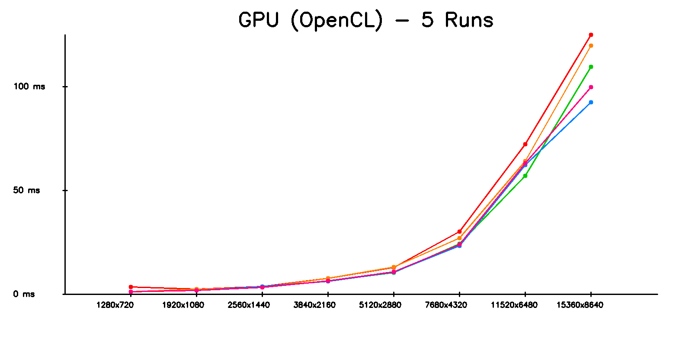
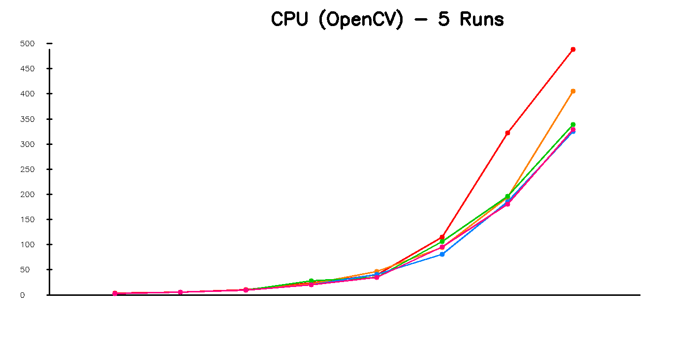

# 🚀 Tối ưu thuật toán Sobel bằng OpenCL

Dự án này mở rộng thuật toán Sobel theo **3 hướng xử lý**:

- **CPU tuần tự** (OpenCV `filter2D`)
- **CPU song song (OpenMP)** – tự viết
- **GPU (OpenCL)** – chạy kernel edge_filter.cl

Dự án cũng:
- Chạy mỗi phương pháp **5 lần**, trên **nhiều độ phân giải ảnh**
- Xuất file **results.csv**
- Tạo **3 biểu đồ** tương ứng cho GPU / CPU tuần tự / CPU song song
- Xuất ảnh đã xử lý để so sánh trực quan

---

# 🧠 Kiến trúc xử lý

## 1️⃣ CPU tuần tự (OpenCV)

CPU sử dụng Sobel kernel:

```cpp
cv::filter2D(input, gx, CV_16S, kernelX);
cv::filter2D(input, gy, CV_16S, kernelY);
cv::convertScaleAbs(...);
cv::addWeighted(...);
```

Đây là phiên bản tối ưu của OpenCV, đã vectorized (SSE/AVX) rất mạnh.

## 2️⃣ CPU song song (OpenMP)

Đã tự implement Sobel:

```cpp
#pragma omp parallel for collapse(2)
for (int y = 1; y < h - 1; y++)
    for (int x = 1; x < w - 1; x++)
        output.at<uchar>(y,x) = ...
```

## 3️⃣ GPU (OpenCL)

GPU thực hiện đầy đủ convolution:

```c
sumX += pixel * Gx[i];
sumY += pixel * Gy[i];
magnitude = sqrt(sumX*sumX + sumY*sumY);
```

Ưu điểm:
- xử lý hàng nghìn pixel song song
- throughput cực lớn
- phù hợp convolution kernel

---

# 📊 Kết quả

- File **results.csv** chứa:

```bash
RESOLUTION, GPU_1..GPU_5, CPU_1..CPU_5, OMP_1..OMP_5
```
- File **summary.csv** chứa:

```bash
RESOLUTION, CPU_mean_ms, GPU_mean_ms, OMP_1_mean_ms ... OMP_8_mean_ms, Speedup_GPU, Speedup_OMP_1 ... Speedup_OMP_8
```

- Dự án đã vẽ 3 biểu đồ:





Mỗi biểu đồ gồm **5 đường** tương ứng 5 lần chạy.

- Kết quả ảnh với độ phân giải nhỏ nhất và lớn nhất khi đi qua GPU_OpenCL


- Kết quả ảnh với độ phân giải nhỏ nhất và lớn nhất khi đi qua CPU_OpenCV (tuần tự)


- Kết quả ảnh với độ phân giải nhỏ nhất và lớn nhất khi đi qua CPU_OpenMP


---

# 📁 Cấu trúc dự án

```
input/         ← chứa ảnh .jpg
output/
    results.csv
    summary.csv
    GPU_xxx.jpg
    CPU_xxx.jpg
    OMP_xxx.jpg
    chart_cpu.png
    chart_gpu.png
    chart_omp.png

kernels/
    edge_filter.cl

edge_detect.cpp
Makefile
README.md
```

---

# 🛠 Makefile (đã hỗ trợ OpenMP)

```makefile
CXX = g++
CXXFLAGS = -std=c++17 -O2 -Wall -Wextra -fopenmp
```

---

# 📝 Kết luận

## **GPU hiệu quả nhất**
### 🏆 1. GPU OpenCL — nhanh nhất
- Nhanh hơn CPU gấp 3.7 lần
- Nhanh hơn OpenMP gấp 15 lần
- Khi ảnh lớn (8K–16K) tăng tốc còn mạnh hơn

### 🥈 2. CPU OpenMP song song 

### 🥉 3. CPU tuần tự (OpenCV filter2D)

