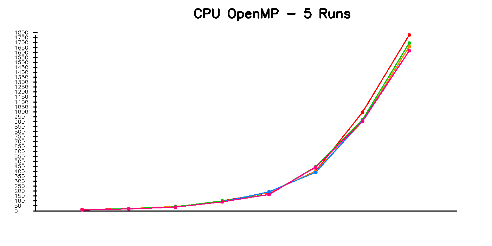

# 🚀 Tối ưu thuật toán Sobel bằng OpenCL

Dự án này mở rộng thuật toán Sobel theo **3 hướng xử lý**:

- **CPU tuần tự** (OpenCV `filter2D`)
- **CPU song song (OpenMP)** – tự viết
- **GPU (OpenCL)** – chạy kernel edge_filter.cl

Dự án cũng:
- Chạy mỗi phương pháp **5 lần**, trên **nhiều độ phân giải ảnh**
- Xuất file **results.csv**
- Tạo **3 biểu đồ** tương ứng cho GPU / CPU tuần tự / CPU song song
- Xuất ảnh đã xử lý để so sánh trực quan

---

# 🧠 Kiến trúc xử lý

## 1️⃣ CPU tuần tự (OpenCV)

CPU sử dụng Sobel kernel:

```cpp
cv::filter2D(input, gx, CV_16S, kernelX);
cv::filter2D(input, gy, CV_16S, kernelY);
cv::convertScaleAbs(...);
cv::addWeighted(...);
```

Đây là phiên bản tối ưu của OpenCV, đã vectorized (SSE/AVX) rất mạnh.

---

## 2️⃣ CPU song song (OpenMP)

Đã tự implement Sobel:

```cpp
#pragma omp parallel for collapse(2)
for (int y = 1; y < h - 1; y++)
    for (int x = 1; x < w - 1; x++)
        output.at<uchar>(y,x) = ...
```

## 3️⃣ GPU (OpenCL)

GPU thực hiện đầy đủ convolution:

```c
sumX += pixel * Gx[i];
sumY += pixel * Gy[i];
magnitude = sqrt(sumX*sumX + sumY*sumY);
```

Ưu điểm:
- xử lý hàng nghìn pixel song song
- throughput cực lớn
- phù hợp convolution kernel

---

# 📊 Kết quả

File **results.csv** chứa:

```
RESOLUTION, GPU_1..GPU_5, CPU_1..CPU_5, OMP_1..OMP_5
```

Dự án đã vẽ 3 biểu đồ:




Mỗi biểu đồ gồm **5 đường** tương ứng 5 lần chạy.

---

# 📁 Cấu trúc dự án

```
input/         ← chứa ảnh .jpg
output/
    results.csv
    GPU_xxx.jpg
    CPU_xxx.jpg
    OMP_xxx.jpg
    chart_cpu.png
    chart_gpu.png
    chart_omp.png

kernels/
    edge_filter.cl

edge_detect.cpp
Makefile
README.md
```

---

# 🛠 Makefile (đã hỗ trợ OpenMP)

```makefile
CXX = g++
CXXFLAGS = -std=c++17 -O2 -Wall -Wextra -fopenmp
```

---

# 📝 Kết luận

## **GPU hiệu quả nhất**
### 🏆 1. GPU OpenCL — nhanh nhất
- Nhanh hơn CPU gấp 3.7 lần
- Nhanh hơn OpenMP gấp 15 lần
- Khi ảnh lớn (8K–16K) tăng tốc còn mạnh hơn

### 🥈 2. CPU tuần tự (OpenCV filter2D)
- Tối ưu hóa cực tốt với SIMD
- Dù chỉ 1 core nhưng vượt xa OpenMP nhiều core

### 🥉 3. CPU OpenMP tự code – chậm nhất

## ❗ **OpenMP lại chậm hơn CPU tuần tự?**

Đây là **hiện tượng bình thường**, nguyên nhân gồm:

### ⚠ 1. `input.at<uchar>(...)` cực kỳ chậm trong vòng lặp song song  
- Khi dùng trong vòng lặp lớn, chi phí này cộng dồn khiến tốc độ bị giảm, làm mất lợi ích của đa luồng.  
➡ **không phù hợp cho OpenMP**

### ⚠ 2. Tiêu tốn tài nguyên để tạo thread
- Mỗi lần OpenMP tạo nhiều luồng (threads), CPU phải tốn thời gian thiết lập và đồng bộ. Đối với tác vụ Sobel vốn rất nhẹ, thời gian tạo thread có khi còn lâu hơn thời gian xử lý thật sự.

### ⚠ 3. CPU tuần tự dùng OpenCV đã tối ưu bằng AVX/SIMD còn CPU dùng OpenMP thì không
- Hàm Sobel của OpenCV dùng tối ưu cấp thấp (SIMD SSE/AVX), tối ưu cache, tối ưu nhánh.
➡ 1 core OpenCV có thể nhanh hơn cả **4–8 core** code tự viết.

### ⚠ 4. SIMD và không SIMD (SIMD là 1 cơ chế cho phép 1 lệnh có tác động trên nhiều dữ liệu)
- CPU OpenMP chỉ song song hóa đa luồng, không tự vector hóa tốt. Không có SIMD thì mỗi luồng sẽ xử lý ít dữ liệu hơn, nên tốc độ không vượt qua được CPU tuần tự đã có SIMD của OpenCV.
